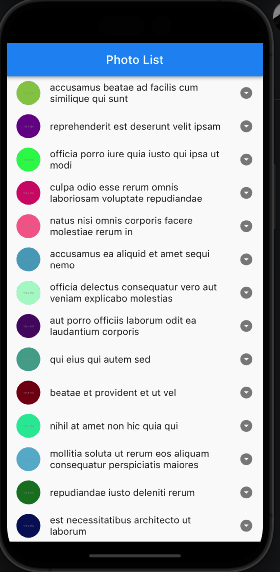

# omnipro

A new Flutter project.

## Flutter SDK version

3.7.3

## Features

- Clean architecture
- Arquitectura modular
- Patron BloC
- Manejo de errores
- Inyección de dependencias
- Test unitarios

## Observaciones

No vi en la doc de la api el soporte para paginación, sin embargo en aras de cumplir el requerimiento se implementa una
lógica que trae todos los resultados la primera vez, se almacena en el estado de la lista y se traen lotes de 20, esto
para lograr que se llene la pantalla y el scroll tenga efecto, no se hizo con 10 por que nos quedaba corto el scroll y
no se iba a disparar el evento de traer resultados al finalizar el scroll.

No me enfoqué mucho en la UI, tenemos algo básico, quise más mostrar el flujo de datos, una arquitectura robusta y
escalable, los test, un buen manejador de estados(BloC), manejo de errores, Injección de dependencias y por supuesto un
código legible y limpio.

Respecto a la ejecución traté de no usar generadores de código para facilitarla, bastará con instalar una versión de
flutter compatible, en este caso se trabajó con la 3.7.3, tener el ambiente para la ejecución, clonar, ejecutar el
comando "flutter pub get" para instalar dependencias y hacer la
ejecución ya sea en un dispositivo android o IOS.
